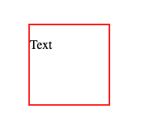
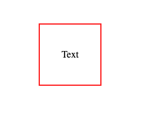
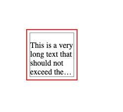

# Centering-text-Text

There are multiple ways to center text horizontally / vertically within a container. We will look at some of the most common ways to do so.

**HTML**
```html
div class="container">
  <p>
    Text
  </p>
</div>
```

**CSS**
```css
.container {
  width: 100px;
  height: 100px;
  border: 2px solid red;
}
```



## Flexbox


**CSS**
```css
.container {
  margin-top: 100px;
  margin-left: 100px;
  width: 100px;
  height: 100px;
  border: 2px solid red;
  display: flex;
  align-items: center;
  justify-content: center;
}
```




## Grid

```css
.container {
  margin-top: 100px;
  margin-left: 100px;
  width: 100px;
  height: 100px;
  border: 2px solid red;
  display: grid;
  align-items: center;
}
```

or 

```css
.container {
  margin-top: 100px;
  margin-left: 100px;
  width: 100px;
  height: 100px;
  border: 2px solid red;
  display: grid;
  place-items: center;
}
```


## Addition: Fixing the max. number of rows

**HTML**
```html
<div class="container">
  <div class="text-container">
    <p> 
          This is a very long text that should not exceed the red box.
    </p>
  </div>
</div>
```

**CSS**
```css
.container {
  width: 100px;
  height: 100px;
  border: 2px solid red;
  display: grid;
  align-items: center;
}

.text-container {
  margin: 5px;
  border: 1px solid grey;
  max-height: 95px;
  overflow: hidden;
  display: -webkit-box;
  -webkit-line-clamp: 4;
  -webkit-box-orient: vertical;
}
```


