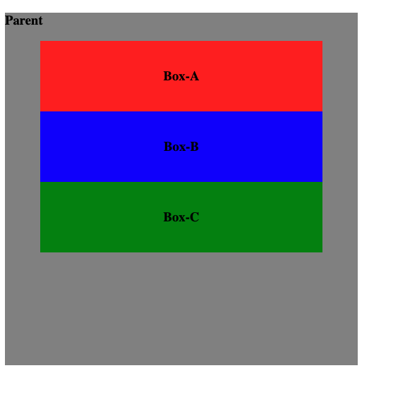
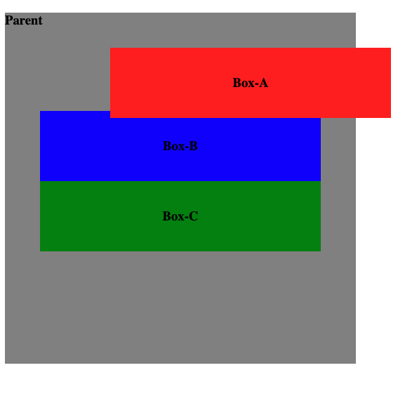
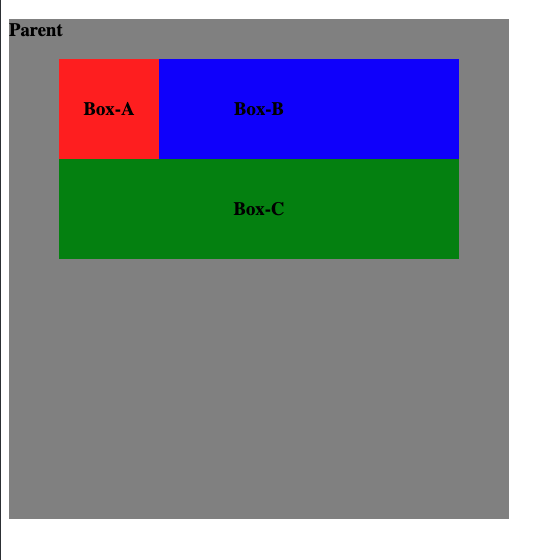
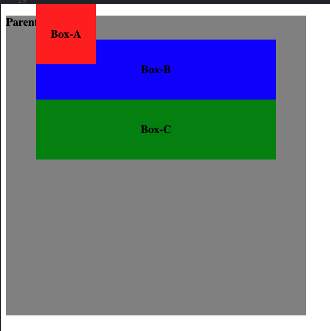

# Positioning

The [position](https://developer.mozilla.org/en-US/docs/Web/CSS/position) property can be used to define how an element in positioned within a document. It does **not** specify the final location, but more the rules for how the element should be positioned.

To illustrate the `position` property, lets take a look at the following example (Referring to this video: [Learn CSS Position in 9 Minutes](https://www.youtube.com/watch?v=jx5jmI0UlXU)) with three boxes in a single parent:

**HTML**
```html
<div class="parent">
  
  <h3>
  Parent
  </h3>
  
  <div class="box a">
    <h3>
        Box-A
    </h3>
  </div>
  
  <div class="box b">
    <h3>
        Box-B
    </h3>
  </div>
  
  <div class="box c">
    <h3>
        Box-C
    </h3>
  </div>
</div>
```

And the corresponding styles without any explicit positioning defined.

**CSS**
```css
.parent {
  width: 500px;
  height: 500px;
  background-color: grey;
}

.box {
  margin-left: 50px;
  width: 400px;
  height: 100px;
}

.box.a {
  background-color: red;
}

.box.b {
  background-color: blue;
}

.box.c {
  background-color: green;
}


div.box h3 {
  line-height: 100px;
  margin: 0;
  text-align: center;
}
```

## Static Positioning (Default)

Follows the order of the elements in the document flow i.e. whatever comes first in the HTML will be rendered first.
This is the **default** behavior.



## Relative

Similar to the `static` positioning, but it lets use define the `top`, `bottom`, `left`, `right` properties to adjust the position of the element relative to its default (static) position.

For example, lets adjust the `Box-A` to be moved 100 pixels to the right and 10 pixels down from the original static position:

**CSS**
```css
.box.a {
  background-color: red;
  position: relative;
  left: 100px;
  top: 10px;
}
```



The `relative` positioning takes the `Box-A` out of the document flow, even overflowing the parent element and the `Box-B`. The space of the original position is still reserved for the `Box-A`, even though the actual element is moved to the right. The other two boxes still follow the original document flow and are therefore not affected by the change.

This is why the `relative` position with the additional properties should be used with respect, because removing the object from the document flow makes alignment of multiple objects difficult.


## Absolute

Completely removes the element from the document flow without reserving the space for the element. Hence, it is similar to the `relative` positioning but the other elements will behave as if the element does not exist in the first place.

**CSS**
```css
.box.a {
  position: absolute;
  background-color: red;
  width: 100px;
}
```



Elements positioned `absolute` always references to another `positioned` (**non-static**) element i.e. are placed absolutely within this element. If there is no such element, it will reference to the `body` element.
Hence, when we want to absolutely position an element within a parent element with for example `top` and `left`, we need to make sure that the parent element is `positioned` as well.

## Fixed

Similar to `absolute` positioned elements, but always referring to the complete HTML document rather than any parent element.

So even though we position the parent element, a `fixed` positioned element with `top: 0px;` will float to the full HTML document rather to the parent:

**CSS**
```css
.parent {
  width: 500px;
  height: 500px;
  background-color: grey;
  position: relative;
}

.box.a {
  position: fixed;
  background-color: red;
  width: 100px;
  top: 0px;
}
```




Moreover, `fixed` moves with the page if scrolling. This can be used to create a fixed navigation bar for example.

## Sticky

A combination of `relative` and `fixed` positioning. The element is positioned relative to its parent element, but when scrolling, it will behave like a `fixed` positioned element and stays fixed at the same position.
