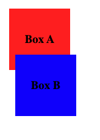

# Z-Index

Property [z-index](https://developer.mozilla.org/en-US/docs/Web/CSS/z-index?retiredLocale=de) specifies the stack order of an element. An element with greater stack order is always in front of an element with a lower stack order. By default, whichever element comes last in the markup will overlap the previous ones. The `z-index` can be used to adjust this behavior and helps us to explicitly set elements to the foreground / background.

Lets draw two boxes `Box-A` and `Box-B` with different background colors.


**HTML**
 ```html
<div class="box a">
  <h3>
    Box A
  </h3>
</div>


<div class="box b">
  <h3>
    Box B
  </h3>
</div>
 ```

**CSS**
```css
.box {
  position: relative;
  height: 100px;
  width: 100px;
}

.box.a {
  top: 10px;
  left: 10px;
  background-color: red
}

.box.b {
  margin-top: -15px;
  margin-left: 20px;
  background-color: blue
}


div.box h3 {
  line-height: 100px;
  margin: 0;
  text-align: center;
}
```

The `Box-B` is drawn after `Box-A` in the markup. So, by default `Box-B` will overlap `Box-A`, as seen in the following image:



To adjust the default behavior, we can increase the z-index of the `Box-A`:

**CSS**
```css
.box.a {
  top: 10px;
  left: 10px;
  background-color: red;
  z-index: 20;
}

.box.b {
  margin-top: -15px;
  margin-left: 20px;
  background-color: blue;
  z-index: 10;
}

```


## Child and Siblings

The `z-index` property is applied to both child and sibling elements. The `z-index` of a child element is always relative to its parent. The `z-index` of a sibling element is relative to its parent and other siblings.

Lets add another box `Box-C` inside `Box-B` with a even higher `z-index` than the red `Box-A` that is currently in the foreground.

**HTML**
```html
<div class="box a">
  <h3>
    Box A
  </h3>
</div>


<div class="box b">
  <div class="box c">
    <h3>
      Box C
    </h3>
  </div>
  <h3>
    Box B
  </h3>  

</div>
```

```css
.box.c {
  position: absolute;
  top: 0px;
  right: 0px;
  background-color: orange;
  width: 50px;
  height: 50px;
  z-index: 1000;
}
```

We would expect the `Box-C` to be drawn on top of `Box-A` and `Box-B`. But, since `Box-C` is a child of `Box-B`, its `z-index` is relative to `Box-B` and not the root element. So, `Box-C` will be drawn on top of `Box-B` but not `Box-A`.


## Local Stacking Context

One reason for this behavior is the local stacking context of `Box-B`. Elements with a defined `z-index` create a local stacking context. The local stacking context is a group of elements that are stacked together as a unit. By defining the `z-index` of `Box-B`, we created a local stacking context and all the child elements will be referenced to this context, rather to the root element.

If we remove the `z-index` of `Box-B`, then `Box-C` will not refer to the local stacking context of `Box-B` but to the same one as `Box-A`.

**CSS**
```css
.box.a {
  top: 10px;
  left: 10px;
  background-color: red;
  z-index: 20;
}

.box.b {
  margin-top: -15px;
  margin-left: 20px;
  right: 0px;
  background-color: blue;
}


.box.c {
  position: absolute;
  top: 0px;
  right: 0px;
  background-color: orange;
  width: 50px;
  height: 50px;
  z-index: 1000;
}
```


## Positioning

The property can only be applied to [positioned](https://developer.mozilla.org/en-US/docs/Web/CSS/position) elements i.e. elements with non-static positioning.
